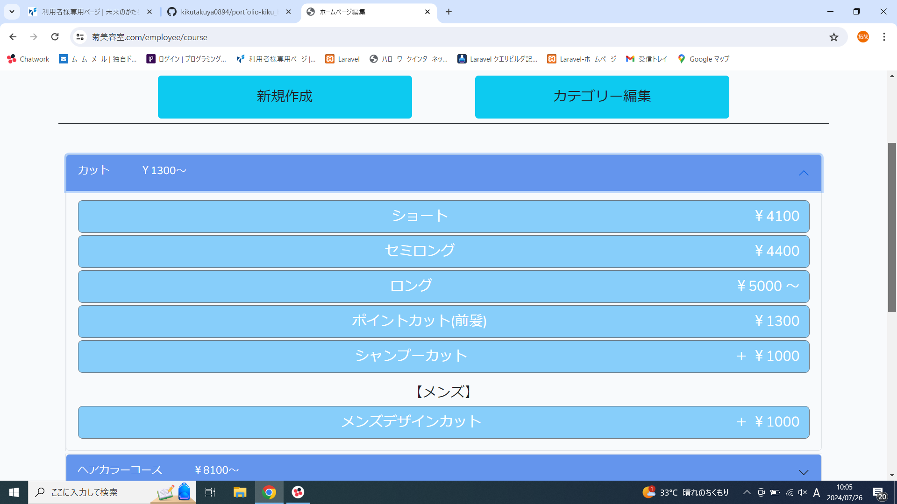
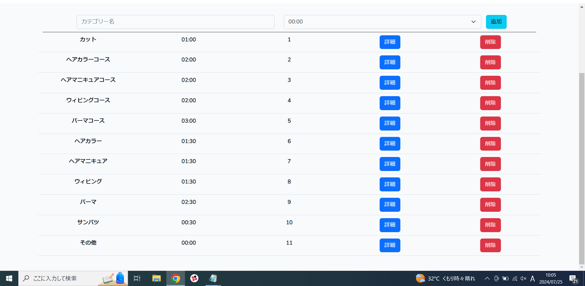
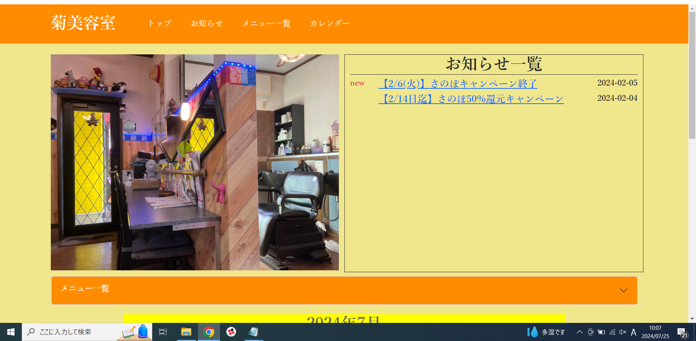
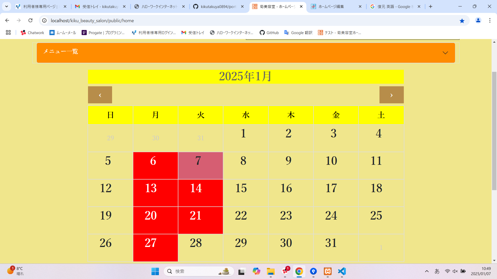
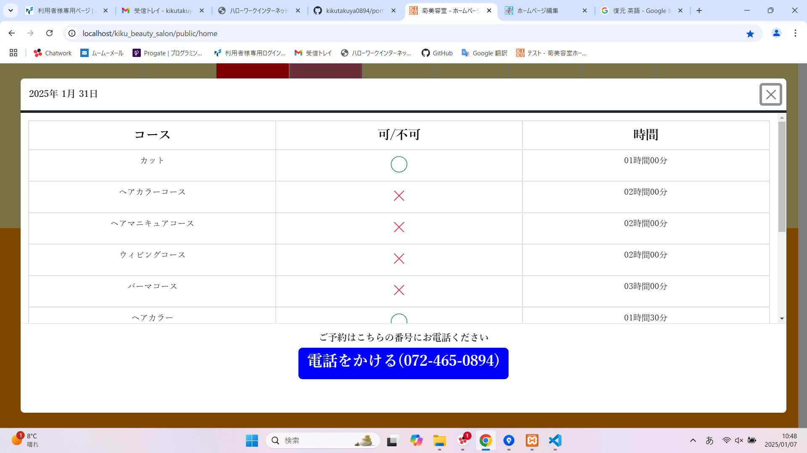

# 【ホームページ＆予約管理システム】
実家の美容室で運用する予定で作った予約管理システムと、予約が確認できるホームページです。 
管理ページでは予約の[追加][更新][削除]などができます。 
ホームページではカレンダーがあり、予約ができるかの確認ができます。 
製作期間は約3ヶ月です。 
 

菊美容室のホームページ 
https://xn--wbttbx74p4sd.com/home  

# 使用技術
・PHP  
・Laravel  
・Bootstrap 
・JavaScript 
・jquery 

# こだわったポイント
　ユーザビリティを高めるために、予約の追加などの処理は 
　JavaScriptやjqueryを使ってすべて非同期処理で作りました。 

# 苦労したポイント
　予約が重複したときの判定処理や、予約の時間が赤くなる処理、 
　ホームページのカレンダーの処理などの時間や日付の計算処理を 
　作るのに苦労しました。 
　

# 機能
【管理ページ】  
予約の管理やカットやパーマなどのメニューの編集ができます。

【初期画面】

・予約管理ページ、メニュー管理ページ、アカウント管理ページなどのページに遷移できるページです。 
 
 

【予約カレンダー初期画面】

・予約管理をするページです。 
　日付をクリックすると予約画面が現れます。 
 
 

【予約入力画面_1】

・予約の開始時間を選択する画面です。 
 
 

【予約入力画面_2】

・予約の詳細を入力する画面です。 
　[予約者名][電話番号][カテゴリー][オフセット]が入力できます。 
 
 

【予約入力画面_3】

・カテゴリーを選択する画面です。 
　選択するカテゴリーで終了時間が自動で変わります。 
 
 

【予約入力画面_4】

 
 

【予約入力画面_5】

・予約完了後、予約の時間は赤く表示されます。 
 
 

【予約カレンダー_予約後】

・予約の情報はカレンダーにも表示されます。 
 
 

【メニュー管理画面】

・メニューの[追加][更新][削除]ができるページです。 
　[メニュー名][カテゴリー][金額]が入力できます。 
　カテゴリー編集ページにも遷移できます。 
 
 

【カテゴリー編集画面】

・カテゴリーの[追加][更新][削除]ができるページです。 
　[カテゴリー名][所要時間][カテゴリーナンバー(表示する順番)]を入力できます。 
 
 

【ホームページ】  
予約ができるかの確認や料金の確認ができます。
 

【ホームページ_1】 

 
 

【ホームページ_2】 

・美容室の営業日カレンダーです。 
　クリックすると予約ができるか確認ができます。 
 
 

【ホームページ_3】 

・予約ができるか確認ができます。 
　[〇]予約ができる 
　[×]予約ができない 
 
 

