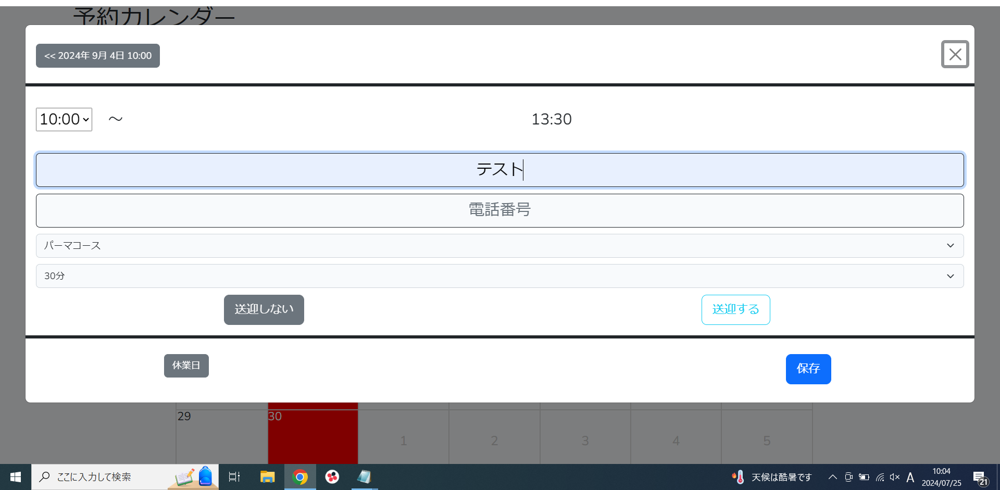

# 【ホームページ＆予約管理システム】
実家の美容室で運用する予定で作った予約管理システムと、予約が確認できるホームページです。 
管理ページでは予約の[追加][更新][削除]などができます。 
ホームページではカレンダーがあり、予約ができるかの確認ができます。 
製作期間は約3ヶ月です。 
 

菊美容室のホームページ 
https://xn--wbttbx74p4sd.com/home  

# 使用技術
・PHP  
・Laravel  
・Bootstrap 

# こだわったポイント
　コメントを忘れずに書くことや1文づつの改行を統一をするなど、 
　他の人が見てもわかりやすくなるように意識しました。 

# 苦労したポイント
　ページネーションの実装の作業が初めてだったため、 
　調べたり実装する作業で想定より1日かかりました。 

# 機能
【管理ページ】  
予約の管理やカットやパーマなどのカテゴリーの編集ができます。

【初期画面】

・予約管理ページ、カテゴリー管理ページ、アカウント管理ページなどのページに遷移できるページです。 
 
 

【予約カレンダー初期画面】

・予約管理をするページです。 
　日付をクリックすると予約画面が現れます。 
 
 

【予約入力画面_1】

・予約の開始時間を選択する画面です。
 
 

【予約入力画面_2】

・予約の詳細を入力する画面です。 
　[予約者名][電話番号][カテゴリー][オフセット]が入力できます。 
 
 

【予約入力画面_3】

・カテゴリーを選択する画面です。 
　選択するカテゴリーで終了時間が自動で変わります。 
 
 

【予約入力画面_4】

 
 

【予約入力画面_5】

・予約完了後、予約の時間は赤く表示されます。 
 
 

【予約カレンダー_予約後】

・予約の情報はカレンダーにも表示されます。 
 
 

無条件検索画面2ページ目】

 
 

無条件検索画面2ページ目】

 
 

【ホームページ】  
