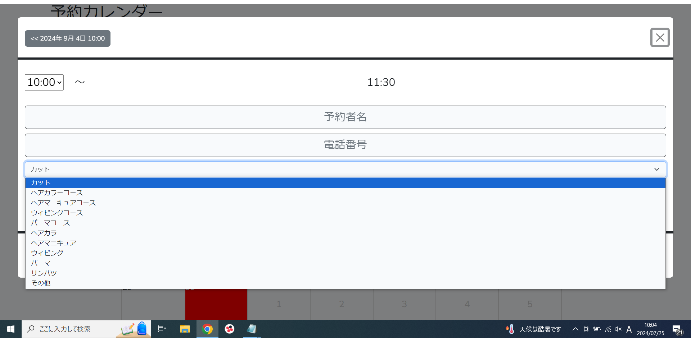
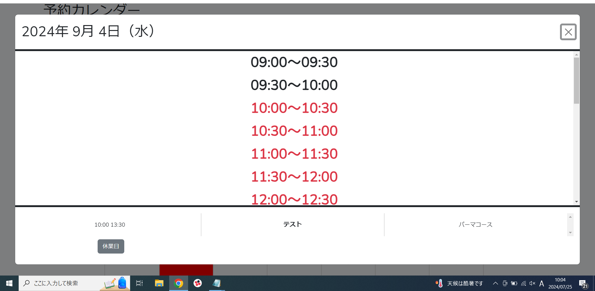
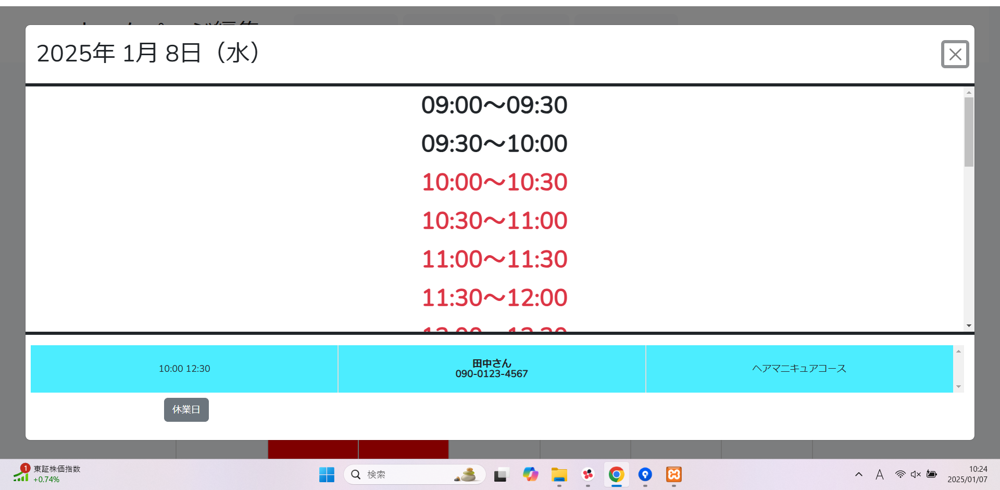
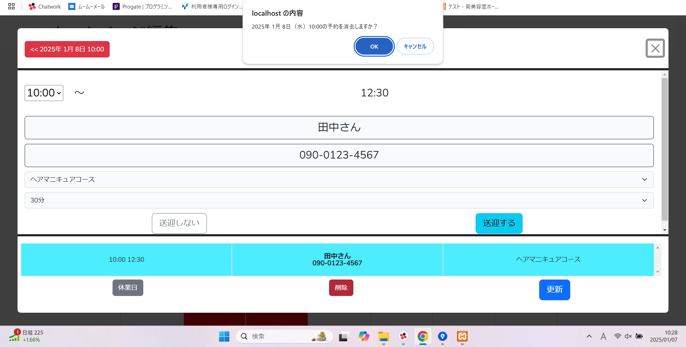
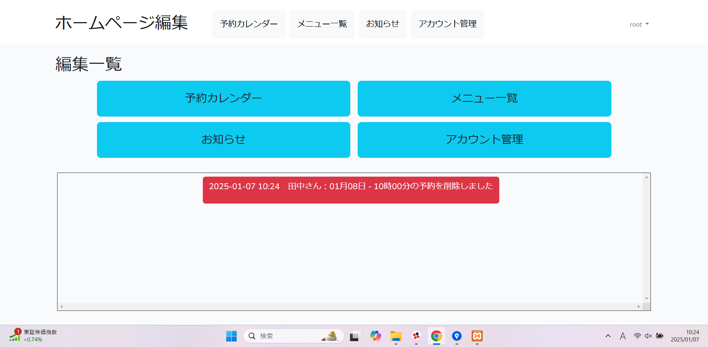
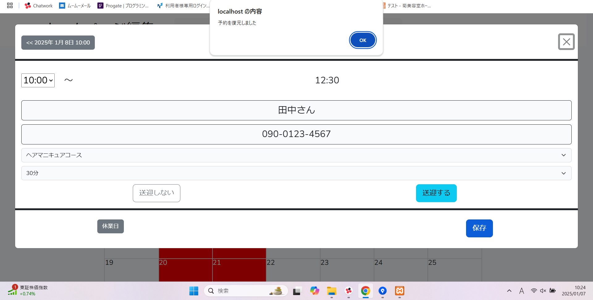
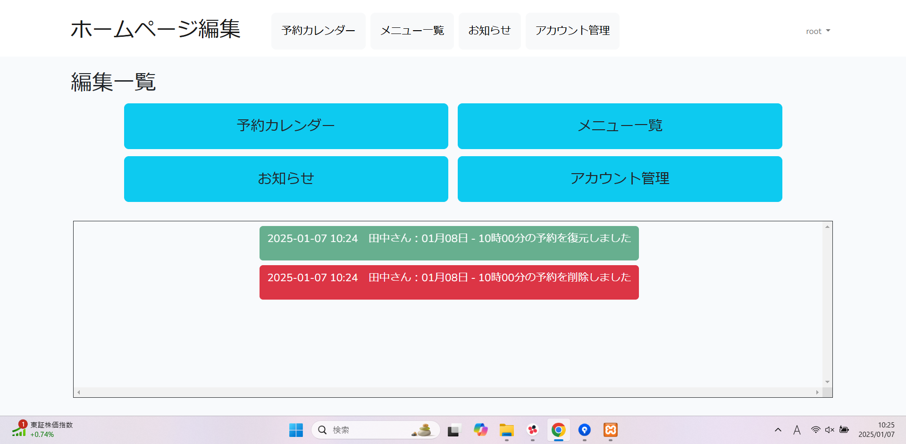
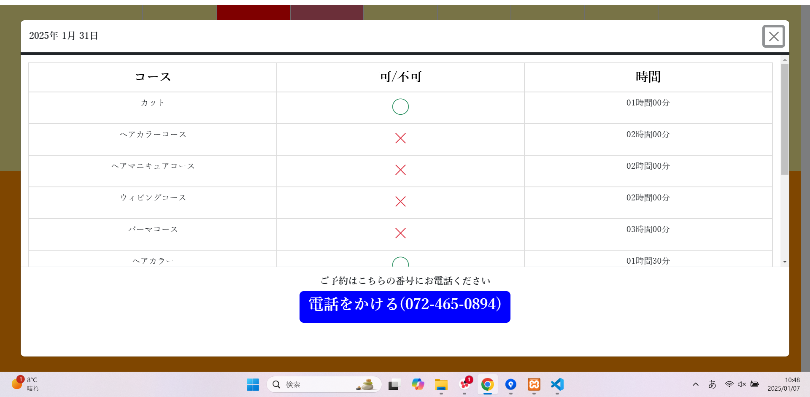

# 【ホームページ＆予約管理システム】
実家の美容室で運用する予定で作った予約管理システムと、予約が確認できるホームページです。 
管理ページでは予約の[追加][更新][削除]などができます。 
ホームページではカレンダーがあり、予約ができるかの確認ができます。 
製作期間は約3ヶ月です。 
 

菊美容室のホームページ 
https://xn--wbttbx74p4sd.com/home  
 
菊美容室のホームページ＆予約管理システムの動画 
https://youtu.be/GVLdrMwehoM  
※この動画は菊美容室で使っているホームページと予約管理システムのテスト環境での動画です。 
テスト環境なため画面が重く、WindowsのXboxGameBarを使って録画しているのでセレクトボックスなどが表示されていません。
 
 

# 使用技術
・PHP 8.0.30 
・Laravel 9.52.7  
・Bootstrap 5.2.3 
・JavaScript 
・jquery 3.4.1 
・MySQL 10.4.32-MariaDB 

# こだわったポイント
　ユーザビリティを高めるために、予約の追加などの処理は 
　JavaScriptやjqueryを使ってすべて非同期処理で作りました。 

# 苦労したポイント
　予約が重複したときの判定処理や、予約の時間が赤くなる処理、 
　ホームページのカレンダーの処理などの時間や日付の計算処理を 
　作るのに苦労しました。 
　

# 機能
【管理ページ】  
予約の管理やカットやパーマなどのメニューの編集ができます。

【初期画面】

・予約管理ページ、メニュー管理ページ、アカウント管理ページなどのページに遷移できるページです。 
 
 

【予約カレンダー初期画面】

・予約管理をするページです。 
　日付をクリックすると予約画面が現れます。 
 
 

【予約入力画面_1】

・予約の開始時間を選択する画面です。 
 
 

【予約入力画面_2】

・予約の詳細を入力する画面です。 
　[予約者名][電話番号][カテゴリー][オフセット]が入力できます。 
 
 

【予約入力画面_3】

・カテゴリーを選択する画面です。 
　選択するカテゴリーで終了時間が自動で変わります。 
 
 

【予約入力画面_4】

 
 

【予約入力画面_5】

・予約完了後、予約の時間は赤く表示されます。 
 
 

【予約カレンダー_予約後】

・予約の情報はカレンダーにも表示されます。 
 
 

【予約削除_1】

・予約を選択すると、予約の詳細が表示されます。 
 
 

【予約削除_2】

・削除ボタンを押すと、確認ダイアログが表示され「OK」を押すと予約が削除されます。 
 
 

【削除・復元ログ_1】

・予約を削除すると、初期画面に削除ログが生成されます。 
 
 

【削除・復元ログ_2】

・削除ログをクリックすると、削除した予約を復元することができます。 
 
 

【削除・復元ログ_3】

・予約を復元すると、初期画面に復元ログが生成されます。 
 
 

【メニュー管理画面】

・ホームページで表示するメニューの[追加][更新][削除]ができるページです。 
　[メニュー名][カテゴリー][金額]が入力できます。 
　カテゴリー編集ページにも遷移できます。 
 
 

【カテゴリー編集画面】

・カテゴリーの[追加][更新][削除]ができるページです。 
　[カテゴリー名][所要時間][カテゴリーナンバー(表示する順番)]を入力できます。 
 
 

【ホームページ】  
予約ができるかの確認や料金の確認ができます。
 

【ホームページ_1】 

 
 

【ホームページ_2】 

・美容室の営業日カレンダーです。 
　クリックすると予約ができるか確認ができます。 
 
 

【ホームページ_3】 

・予約ができるか確認ができます。 
　[〇]予約ができる 
　[×]予約ができない 
 
 

